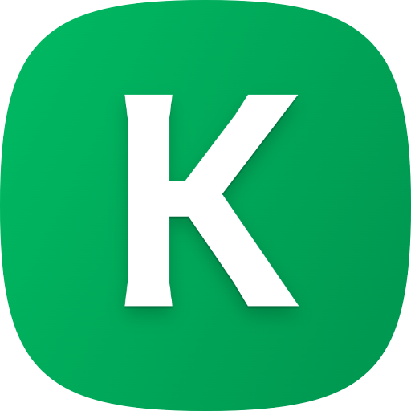

  

<h1 align="center">uKick</h1>

All-in-one extension to **block, boost, and tweak everything** on Kick.com for a better streaming experience.
Take full control of your Kick experience with **uKick** — block unwanted content, filter toxic chat, and enhance your streams with adaptive quality and volume boosting.

## Install

  
  
  
  

<strong>Also available on Quetta Browser</strong>

  
  
  

## Features

- **Block Channels & Categories** — instantly hide streams, categories, and sidebars you don’t want to see
- **Filter Chat Users** — automatically remove messages from blocked users in Kick.com chat
- **Quick Block Buttons** — add one-click block next to usernames and stream cards
- **Real-Time Updates** — changes are applied instantly across Kick.com
- **Manage Your List** — import, export, view, or clear your block list anytime
- **Adaptive Stream Tweaks** — set your preferred resolution (160p -> 4K) and let uKick auto-adjust quality
- **Volume Boost (1x -> 10x)** — go beyond Kick’s default volume limit for a better audio experience
- **Privacy Friendly** — runs only on Kick.com

## Disclaimer

This extension is not affiliated with or endorsed by Kick.com.
