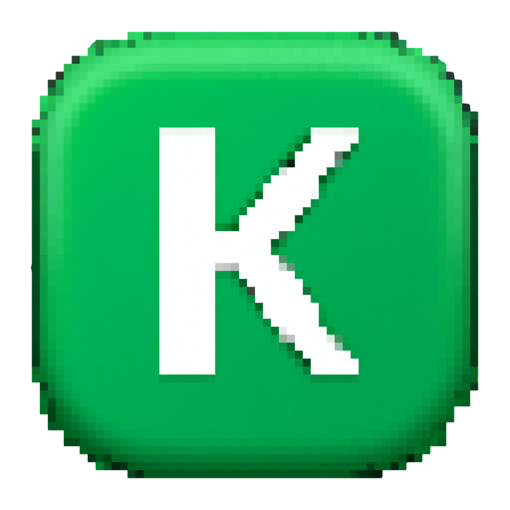

  

<h1 align="center">uKick</h1>

Block channels, categories, and tags, filter toxic chat messages, and enhance your streams with adaptive quality control and volume boosting. All changes are applied instantly, giving you full control over your homepage, sidebar, live chat, and video player.

## Install

- [Chrome Web Store](https://chromewebstore.google.com/detail/ukick-%E2%80%94-block-everything/ifndlnhdiommaehhmeomdggeknpikjek)
- [Edge Add-ons](https://microsoftedge.microsoft.com/addons/detail/ukick-%E2%80%94-block-everything-/dpkahlbhnkllhalhggfogkppbnlajfle)
- [Firefox Add-on](https://addons.mozilla.org/en-US/firefox/addon/ukick/)

## Features

- **Mobile Support:** Use uKick on all Chromium-based/Firefox-based browsers (via Quetta Browser/Firefox Mobile).
- **Block Channels, Categories, and Tags:** Removes unwanted streams and content from the DOM.
- **Filter Chat Users:** Automatically hides and marks messages from blocked users in Kick chat.
- **Quick Block Buttons:** Adds one-click ✕ block buttons next to usernames, stream, and category cards.
- **Danmaku Chat:** Enables on-screen bullet comments for an immersive streaming experience.
- **Swap Chat Direction:** Move the chat panel to the left or right side of the screen.
- **Active Users Stats:** Displays the number of active viewers and messages processed.
- **Adaptive Stream Quality:** Set your preferred resolution (160p to 4K) and enable auto-quality adjustment.
- **Volume Boost (1x - 10x):** Exceed Kick's default volume limit for a better audio experience.
- **Remote Subscriptions:** Subscribe to JSON blocklist URLs.
- **Auto-Sync:** Update subscriptions automatically at configurable intervals.
- **Manual & Bulk Update:** Update lists individually or all at once.
- **Manage Your Lists:** Export, import, merge, or clear block lists as JSON.
- **Themes:** Customize the Kick interface with different color palettes.
- **Search History Control:** Option to disable Kick search history tracking.
- **Multi-language:** Supports Arabic (ar), Czech (cs), German (de), English (en), Spanish (es), Finnish (fi), French (fr), Hebrew (he), Indonesian (id), Italian (it), Japanese (ja), Korean (ko), Polish (pl), Portuguese (pt_BR, pt_PT), Russian (ru), Turkish (tr), Vietnamese (vi), and Chinese Simplified (zh_CN).
- **Customizable Interface:** Toggle chat filtering, block buttons, and other features as needed.
- **OpenLapis Integration:** Send blocklists and data to SolidWriting and SolidSheets via native messaging.
- **Local & Private:** Runs locally on Kick domains; no tracking, servers, or ads.

## Disclaimer

This extension is not affiliated with or endorsed by Kick.com.
